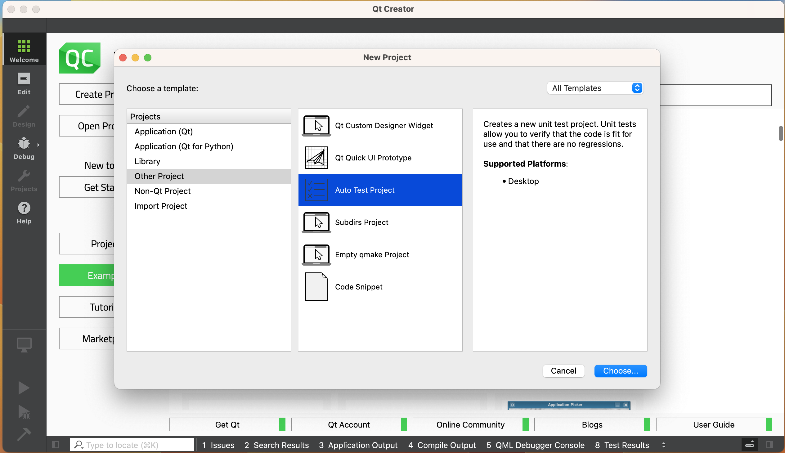

# Qt Creator + Google Test 使用指南

本文档包含：

- 如何在Qt Creator中安装Google Test
- 如何在Qt Creator中使用Google Test 编写测试用例

# 安装指南

1. clone Google Test:  https://github.com/google/googletest.git
2. 打开Qt Creator，创建新项目→Other Project→Auto Test Project



1. 选择Google Test。suite name 和 case name不用管，只是样例测试用例的名字


1. google test路径填google test仓库路径

记得Build System选qmake

1. 无脑Continue

到这里为止，google test的sample project已经配置完毕。尝试运行项目，输出应该如下


hint: 若无法运行，检查自己google test 路径中有没有出现空格/中文。如果出现，请在GOOGLETEST_DIR变量中给路径加上引号。如下图


# 如何使用

在main方法中添加以下代码段：

```jsx
#include <gtest/gtest.h>

int main(int argc, char *argv[])
{
    ::testing::InitGoogleTest(&argc, argv);
    return RUN_ALL_TESTS();
}
```

之后再参照样例的写法编写测试用例即可。测试样例如下

```jsx
#include <gtest/gtest.h>
#include <gmock/gmock-matchers.h>

using namespace testing;

TEST(suit, case)
{
    EXPECT_EQ(1, 1);
    ASSERT_THAT(0, Eq(0));
}
```

suit为测试套件，case为此套件下的不同测试样例

# 文档指路

google test primer: [GoogleTest Primer | GoogleTest](https://google.github.io/googletest/primer.html)

