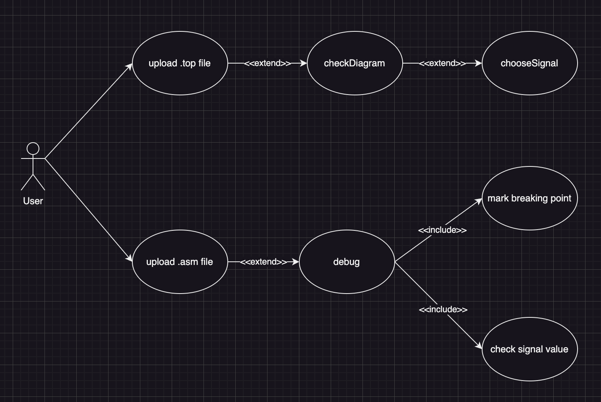

# CS304 Software Engineering Project Milestone 2

## Requirements

- Use case diagram:
    
    
    
- Swim lane diagram:
    
    
    
- Language description:
    
    The entire system is simple, requiring minimum effort from the user, hence the use case cases are extremely simple. Hence only the **********debug********** case will be discussed.
    
    - metadata
        
        
        | Metadata | Details |
        | --- | --- |
        | Name of the use case | Debug |
        | Goal | Enables the user to control the CPU (pause, next, to next breakpoint) remotely |
        | Actor(s) | Users of the Debugger |
        | Trigger | User enters the debug page after programming the FPGA |
        | Entry conditions | The program must detect the CPU through one of the UART ports |
        | Post conditions | The CPU acts according to the remote instructions and return the signal value specified earlier |
    - basic flow
        1. user completed programming the FPGA
        2. the program detects an CPU on one of the computer’s UART port (by scanning with `PING` signals)
        3. the CPU pauses initially
        4. user selects an `.asm` file and loads it to the FPGA through the UART port previously detected, the CPU will stop after the first instruction
        5. user select breakpoints on the side-panel 
        6. user remotely resumes CPU execution by instructing the CPU with the following signals (the details of the signals are at the protocol design section):
            - `RESUME`: resumes the CPU which will then execute until the next breakpoint
            - `NEXT`: the CPU only executes the next instruction
        7. while the CPU has resumed execution, the user can then optionally pause the CPU (with the `PAUSE` signal)
        8. when user resumes after the last breakpoint, the CPU will halt after the last instruction has been executed 
        9. users can then retransmit a new `.asm` file or restarts the entire program execution (when restarting, altered data in memory will not be rolled back to its original configuration) which will jump to step 5
    - alternate flows
        - user in any steps after 4 can be interrupted by jumping straight to step 5
- Class diagram:
    
    
    
- Data design: as the only input from the user are the `.v` and `.asm` files, the data captured will be structured using two classes
    
    ```cpp
    class CPUSignal {
    public:
        QString   name;         // name of the CPU's signal
        size_t    width;        // the width after byte alignment
        size_t    rawWidth;     // the original width without byte alignment
        QBitArray bitVal;       // value of the signal
    };
    ```
    
    The `.v` will be parsed semantically and its metadata captured. This data is used to construct the diagram graph, generate the debug core module, and used to receive the signal’s value through UART from the CPU.
    
    ```cpp
    class ASMLine {
        size_t  index;          // index of the instruction in the program
        QString line;           // the instruction line
        bool    isCurrent;      // whether the CPU paused on this instruction
        bool    isBreakPoint;   // whether the this is a breakpoint
        bool    isInstruction;  // false for any labels or data
    };
    ```
    
    The `.asm` will also be parsed line by line, capturing only instructions while excluding the `.data` and `label`s. Each line will be captured in the class which will then be used by the program to highlight the current instruction and assist in creating breakpoints.
    
- UI design:
    1. select `top.v`'s directory
        
        
        
    2. select signals directly on a diagram automatically generated
        
        
        
    3. select the output directory for the debug core, and generate the bitstream using VIVADO (the `top.v` file will be automatically updated to instantiate and connect the correct wires)
        
        
        
    4. the CPU will halt at be start, breakpoints can be then selected and then the CPU will be remote controlled (there is also an option to load a `.asm` file to the CPU through UART)
        
        
        
- Protocol design:
    - From CPU
        
        > Packets sent from the CPU to PC.
        > 
        
        ---
        
        `SIGNAL`: inform the PC of the signals’ values in the CPU
        
        - Byte 1: opcode `0x01`
        - Byte 2 to 5: value of current program counter (word aligned)
        - Byte 6 onwards: the concatenated signals (byte aligned) and padded with 0s to fit the last byte, the PC should know how many bytes will be sent since it knows which signals are selected and the size of each signal
        
        ---
        
        `OK`: respond to the PC’s `PING`, signaling that the COM port is active
        
        - Byte 1: opcode `0x02`
    - From PC
        
        > Packets which the CPU will be receiving.
        > 
        
        ---
        
        `PING`: to check if the CPU is connected to a specific COM port
        
        - Byte 1: opcode `0x03`
        
        ---
        
        `PAUSE`: to pause the CPU, the instruction freshly fetched will be ensured to complete the entire pipeline, and no new instructions will enter the pipeline
        
        - Byte 1: opcode `0x04`
        
        ---
        
        `RESUME`: resume execution in the CPU until reaching the next breakpoint
        
        - Byte 1: opcode `0x05`
        - Byte 2 to 5: value of the program counter for next breakpoint (word aligned), if resuming after the last breakpoint, simply set this value to the total number of instructions provided by the user multiplied by 4, which will halt the CPU after the last instruction’s execution
        
        ---
        
        `NEXT`: let the CPU execute the next instruction, that instruction will be guaranteed to complete the entire pipeline
        
        - Byte 1: opcode `0x06`
        
        ---
        
        `PROGRAM`: send the ASM file through UART to the CPU’s RAM and ROM, the ASM file should be 64K with the following memory arrangement:
        
        
        
        ASM file memory arrangement
        
        - Byte 1: opcode `0x07`
        - Byte 2 onwards: each byte of the ASM binary file
        
        ---
        
        `RESET`: reset the program counter to 0 and restarts the program again
        
        - Byte 1: opcode `0x08`

## Collaborations

Each team member’s contribution is shown below:

The team collaborated by utilizing `branch`es which provide code isolation functionality, this helps the team when each member is working independently on their components. But while this provides isolation, it also introduces an additional step when consolidating the project. Overall, the `branch`es provide more pros than cons. 

- `main` branch
    
    
    
- `backend` branch
    
    
    
- `debug_core` branch
    
    
    
- `feature` feature branch
    
    
    
- `frontend` frontend
    
    
    

## Deliverables

**Functionalities implemented**

- remotely control the CPU using the UART protocol defined above
- analyze the input directory of `.v` Verilog files and generates corresponding tokens
- automatically generate `uart_unit.v` and alter `top.v` file to instantiate the debug core
- analyze the `.asm` file provided during debug stage

**Deliverables**

- working frontend
- partial backend with auto code generation

**Directory structure**: the code is structured in two main directory, `DebugCore` for the FPGA files, and `CPUDebugger` for the Qt related files. Below are the two main branches’ directory structure:


`debug_core`


`main`